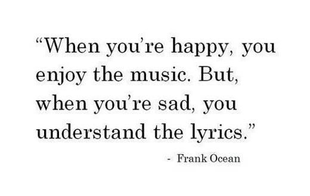
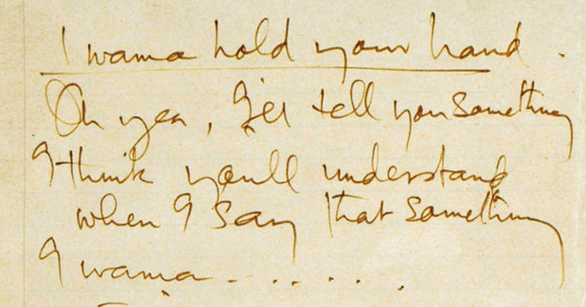
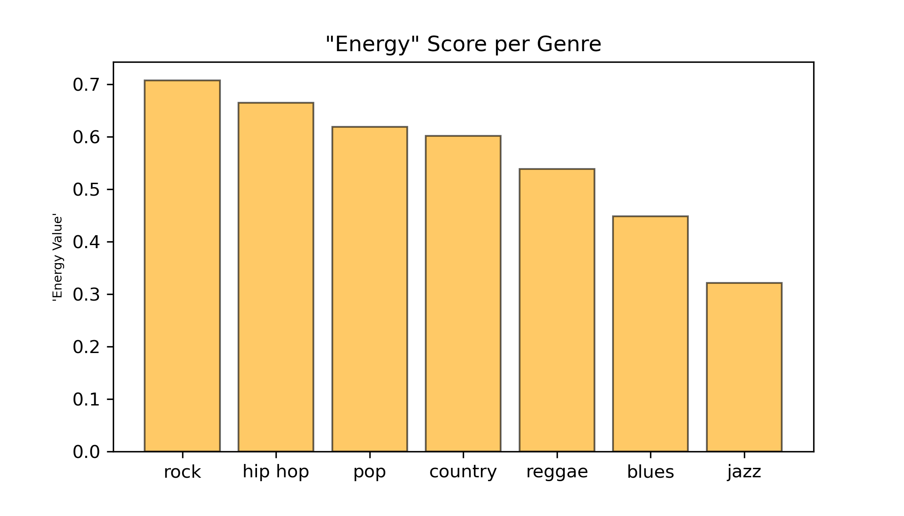
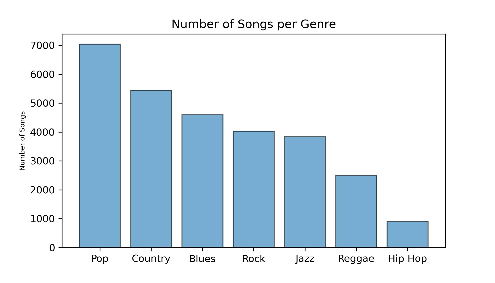
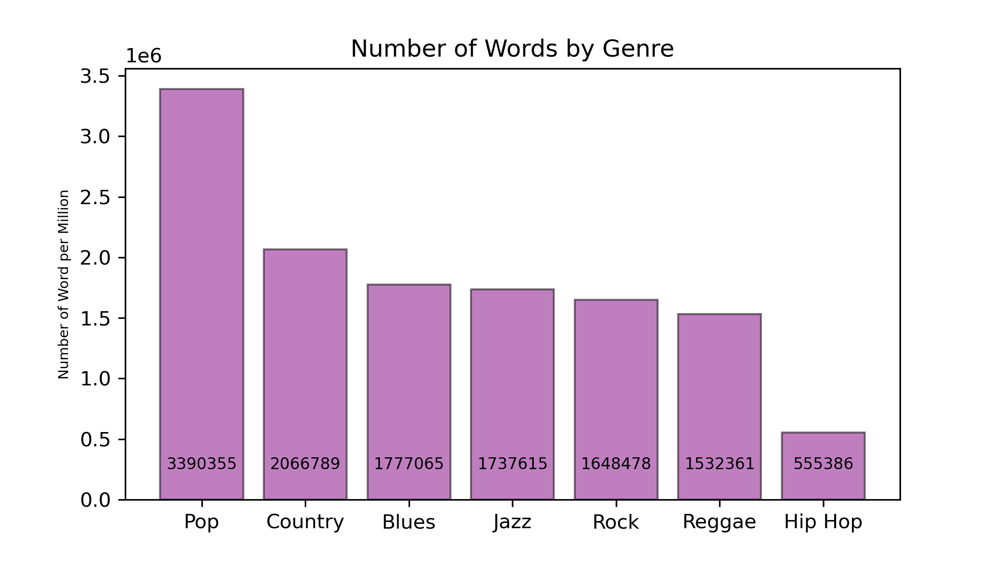
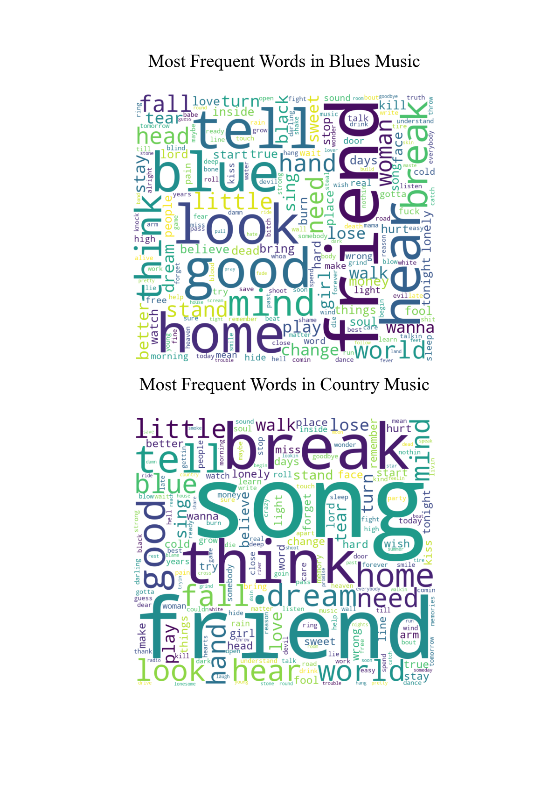
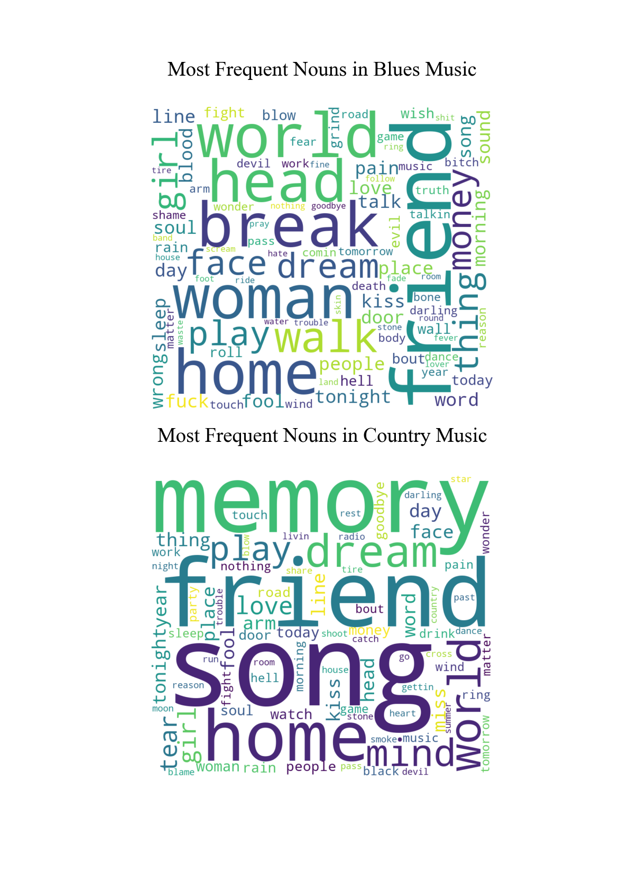
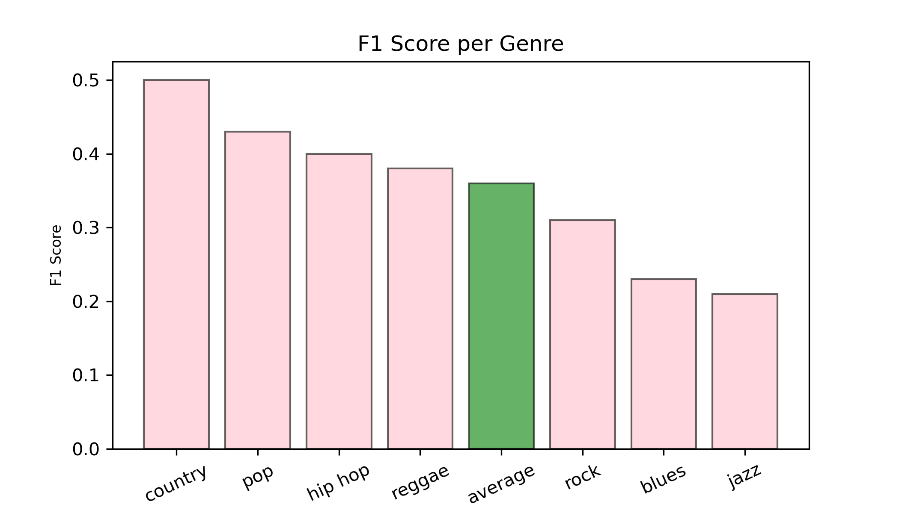
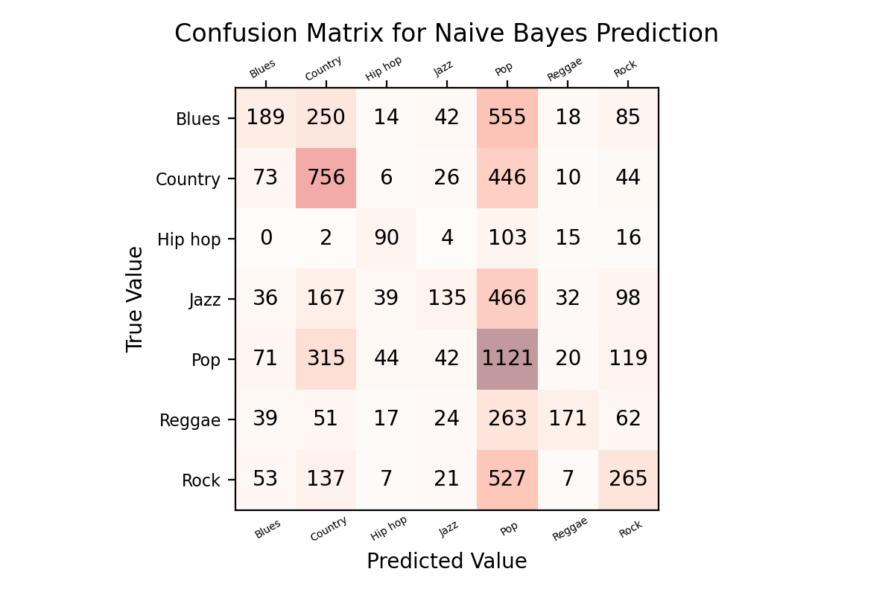
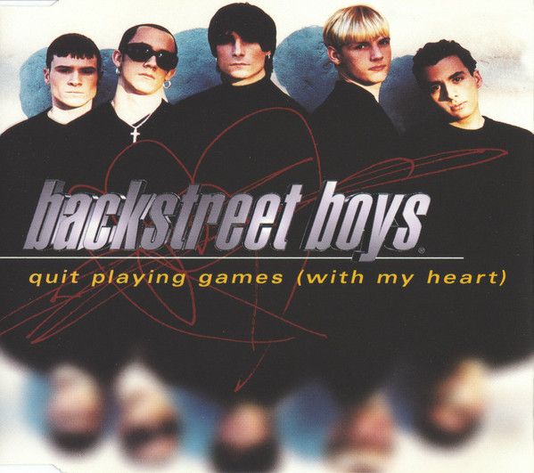

# Understanding Music Lyrics by Genre

#### _Capstone Project II_ by Pedro Meyer


[Pinterest.com](https://www.pinterest.com/pin/103301385174962478/)

## Background & Motivation

Music is a medium like no other. The same way it can transmit emotions and moods through sound, it can also transmit messages through words. Music has this amazing ability to connect a message to an emotion. Artists and genres accomplish this in their own unique ways: some use heartbreaking lyrics with exciting and uplifting sounds, social criticism with slow and mellow music...the possibilities are endless.

This project aims to understand how genres focus on lyric choices in their songs. It also sets out to create an algorithm that can predict a song's genre based on it's lyrics. 

## Data

The main dataset used for this project is titled "Music Dataset: Lyrics and Metadata from 1950 to 2019" made available by [Mendeley Data](https://data.mendeley.com/datasets/3t9vbwxgr5/2). This lengthy dataset includes artist names, songs, lyrics, acoustic metadata and genres for tracks dating back to 1950. It has 28,371 rows of data, with each giving information on an individual song. For the purpose of this project, this dataset was condensed into only artist name, track name, genre and lyrics.

| artist_name     | track_name | genre   |   release_date | lyrics |
|----------:|------:|------:|----:|-----:|
|backstreet boys | as long as you love me | pop     |           1996 | long loneliness friend leave life hand people crazy blind risk glance blind mystery head care write history long care long care long...|


Another more detailed dataset was also used. [This dataset](https://www.kaggle.com/yamaerenay/spotify-dataset-19212020-160k-tracks?select=data_by_artist.csv) was put together using Spotify's API and it has more detailed information on artist's genre and acoustic data. I used this dataset for later comparison of genre predictions to account for possible subgenres.

These are all the subgenres the Backstreet Boys have asigned in this dataset:

|genres | artists |
|-----:|:----------|
['boy band', 'dance pop', 'europop', 'pop'] | Backstreet Boys |"


## The Use of Words in Music

What makes genres of music different? Rhythm, effects, melody, intrument choice, playing techniques; all of those things can help us distinguish one music genre from another. Can we say the same about lyrics? Do the messages from artist in different genres differ enough for an algorithm to be able to predict to which genre a song belongs to based on it's lyircs? 


[cbsnews.com](https://www.cbsnews.com/pictures/the-beatles-original-lyrics/16/)


## Diving into the Data

There are over 2000 genres and subgenres on Spotify. These are just some examples:

```
'a cappella',
 'abstract',
 'abstract beats',
 'abstract hip hop',
 'accordeon',
 'accordion',
 'acid house',
 'acid jazz',
 'acid rock',
 'acid trance',
 'acousmatic',
 'acoustic blues',
 'acoustic pop',
 'acoustic punk',
 'adoracion',
 'adult standards',
 'adventista'...
 ```

The main dataset will condense these into 7 music genres: ***Pop, Rock, Country, Blues, Reggae, Jazz and Hip hop.***

This dataset describes sonic characteristics of a song, such as how lively it is, it's tempo, if it has many instruments or few, a lot of speech or not, etc. Take "energy" for example:

> Energy is a measure from 0.0 to 1.0 and represents a perceptual measure of intensity and activity. Typically, energetic tracks feel fast, loud, and noisy.




To understand the data a bit more, the dataset was divided into songs per genre. What exactly is being compared here? In order to get insight on how much data there is, two plots were generated. One showcasing number of songs per genre and the other number of total words per genre in each genre.



It's clear that the majority of songs are labeled as **"Pop"**, but if lyrics are being compared, what is the total number of words in each genre?




## "What Are They Talking About?"

The first step into finding differences or similarities in the words used in each genre is to parse through the lyrics and find the most used words. Some genres are more distinguishable than others. Words such as "like", "baby", "yeah", among other were removed from this calculation in order to find the most unique words in each genre.

To do this, a Term Frequency/Inverse Data Frequency approach was used. This featurization method will give different weights to genres (the classes) in which a certain word occurs more often.

> Featurizing the data is to translate our categorical data into a language the computer can understand

After a few iterations of removing common words to all classes, I reached a final version of the top 20 words in each genre.

index | genre   | top_20_words|
---:|:--------|:-----------------------------------------------
0 | rock    | {'break, world, think, need, fall, look, tell, mind, hear, head, inside, hand, good, dream, lose, stand, fuck, believe, face, change'}   
1 | hiphop  | {'fuck, shit, bitch, lyric, commercial, tell, wanna, think, need, money, look, real, play, break, gotta, head, hear, game, stop, better'} |\n|  
2 | pop     | {'think, tell, need, fall, world, wanna, look, break, good, girl, hear, dream, mind, stay, home, hand, better, fuck, walk, little'}       |\n|  
3 | reggae  | {'tell, world, good, fuck, need, look, people, mind, think, wanna, hear, stand, fight, black, play, shit, money, girl, hand, fall'}       |\n|  
4 | jazz    | {'world, dream, fall, think, need, tell, hear, mind, good, break, fuck, look, play, sing, hand, stay, wanna, little, lose, change'}       |\n|  
5 | country | {'break, think, tell, good, home, dream, look, hear, world, fall, blue, mind, little, need, hand, walk, sing, lose, play, love'}          |\n|  
6 | blues   | {'tell, good, look, blue, home, hear, mind, think, break, world, need, hand, little, woman, fall, head, stand, change, lose, turn'}       |"


For further analysis, I picked two intuitively different genres to delve into. Here is a comparison of the top 200 words in Blues and Country:



What if a certain type of word tells us a better story? I the SpaCy Library to sort only nouns within the top 200 words. The goal is to dig for further differences between genres by removing verbs that generally are used to describe similar actions. Here are the findings:





 It is hard to say that these genres are different enough in terms of lyrics, but can a model perform well in predicting the song's genre based on the lyrics alone?

## Putting the Computer to Work: Creating Predictions

The next step is to create an algorithm that aims to predict a song's genre based on it's lyrics. 


> ***Bayesian Classification*** \
Naive Bayes classifiers are built on Bayesian classification methods. These rely on Bayes's theorem, which is an equation describing the relationship of conditional probabilities of statistical quantities. In Bayesian classification, we're interested in finding the probability of a label given some observed features

That being said, there are different types of Baysian Classification Models and ways to calculate performance, therefore, I decided to calculate the F1 scores of the Multinomial Naive Bayes since this model's average scores were higher than the other possible approaches.

> ***F1 Scores*** \
In most real-life classification problems, imbalanced class distribution exists and thus F1-score is a better metric to evaluate our model on.

After tweeking the hyperparameters of the model, such as ```max_features``` and ```stop_words```, the highest performance model found has the following f1 scores:



A confusion matrix shows how many songs were correctly predicted in their corresponding genre and what genres they were mistaken for. 

What were our jazz songs getting mistaken for?



In natural language, how well did our model predicted the genre of Backstreet Boys' songs based on the lyrics?

| artist | track | most_likely_genre | 2nd_most_likely_genre | 3nd_most_likely_genre |
|-|-|-|-|-|
| backstreet boys | as long as you love me | pop | reggae | country |
| backstreet boys | the perfect fan | country | reggae | pop |
| backstreet boys | quit playing games (with my heart) | reggae | country | pop |

&nbsp;  

[(https://www.youtube.com/watch?v=Kskym4zjr4s)](https://www.youtube.com/watch?v=Kskym4zjr4s)
&nbsp;  


## Conclusion

Considering the class imbalances in the data and the fact that we are not accounting for important subgenres, the model did a better job in predicting a song's genre based on it's lyrics than random chance. The average prediction score (f1 score) of 37% is higher than the prediction probability of picking one of the seven genres at random, which is approximately 14%. 

There is still room to improve this model, but it is safe to say that it is possible to make an accurate prediction of a song's genre based solely on it's lyrics.


